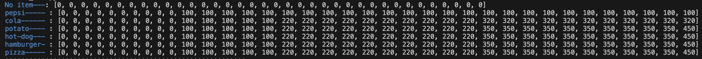

# goit-algo-fp

Algorithms and Data Structures final project.

# Task 1 - Data Structures and Algorithms. Linked List. Merge Sort.

Was implemented Linked List Data structure as class using Python programming language. List has a bunch of regular methods, such as search, delete, insert, reverse, print, as well as sort method using merge sort algorithm and merge and sort, that allows to combine two linked lists into sorted one (with mutation and without).

# Task 2 - Recursion. Pythagoras Tree Fractal.

With the help of recursion and turtle library was created function that allows to build Pythagoras Tree Fractal with appointed level of recursion.
The next picture represents pythagoras tree with the 6 level of recursion.

# Task 3 - Data Structures. Graph and Heap. Dijkstra's Algorithm.

Was created the function that represents Dijkstra's Algorith for finding the shortest path between the source node and all other nodes in a given graph. For subtask to select the vertex with shortest path Heap data structure were used. Moreover, draw_graph function was implemented, that represents visual representation of a given weighted graph.

We can compare the shortest path finding result from vertex A of developed function (first) and networkx library method (second). They are equal.

Shortest path from 'A': {'A': 0, 'B': 5, 'C': 6, 'D': 9, 'F': 11, 'E': 12}
Shortest paths networkx: {'A': 0, 'B': 5, 'C': 6, 'D': 9, 'F': 11, 'E': 12}

# Task 4 - Complete Binary Tree. Heap creation and visualisation. Queue.

Was implemented a class Heap with a method that converts usual array into binary heap data structure and function that visualise the heap with the help of matplotlib library. Such data structure as a Queue was used to build the heap representation.
Below we have an initial array and it's heap array represantion.

Array: [7, 12, 3, 5, 2, 15, 8, 11, 4, 20, 1, 6, 9, 14]
Heap: [1, 2, 6, 4, 3, 7, 8, 12, 11, 20, 5, 15, 9, 14]

The next picture is visual graphical representation of the given heap.

# Task 5 - Binary Tree. Breadth First Search. Deep First search. Queue and Stack.

A function for Binary Tree Visualisation was created. The next picture depicts a binary tree created.

Breadth first search and Deep First Search algorithms realisation was developed. The resuls of both algorithms for traversing a tree are represented in array of sequential vertexes and in a coloured binary tree graph. Each traversing through nodes is depicted from the darker to the lighter color of the vertex for better understanding.

The pictures below are the visual representation of the DFS and BFS functions.
Deep first search: [7, 4, 3, 1, 10, 11, 5, 2, 13, 15]

Breadth first search: [7, 4, 11, 3, 10, 5, 13, 1, 2, 15]

# Task 6 - Greedy Algorithms. Dynamic programming.

The task was to solve caloric maximisation problem with the restricted budget for the given list of food items (for each cost and calories amount are geven).
Two different approaches were implemented, using Greedy algorithm and Dynamic Programing.
As result, we see that greedy algorithm approach is much faster, as it takes an optimal solution in each step, but unfortunately gives us not optimal solution in each case. For example, for the budget of 100$ it resulted in max 870 calories.

Dynamic programming approach is slower, as it requires of destructuring the whole problem onto small subtasks and depends on initial data amount. We need to build a table with optimal solution for each subtask. But it is precise. We obtain the optimal solution in any case. In the same problem for the budget of 100$ it gives us an optimal solution in max 970 calories.

The next picture illustrates how we can solve this optimisation task for the given list of items and 50$ budget dynamic programming. We build the table with optimal solution for each subtask, the last value represents the optimal result.

# Task 7 - Randomized Algorithms. Monte Carlo method.

A function for simulation of two dices tossing was created. It allows us to find approximate solution for each resulting sum probability of appearence calculation based on repeated random sampling. This method is known as Monte carlo method.
The results of simulation are shown below.

As we can see that accuracy of the result depends on the quantity of experiments. And for the number of 100000 experiments result is quite accurate and very close to the results calculated with analytical methods. This allows us to conclude an effectiveness of randomized algorithms for definite types of problems.

The next graphs depict that at incresing number of experiments we reach the Normal or Gaussian distribution of probabilities.

